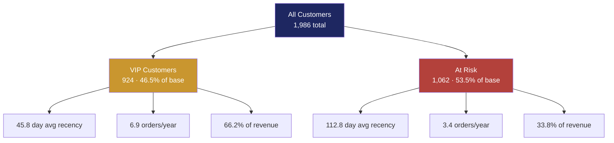
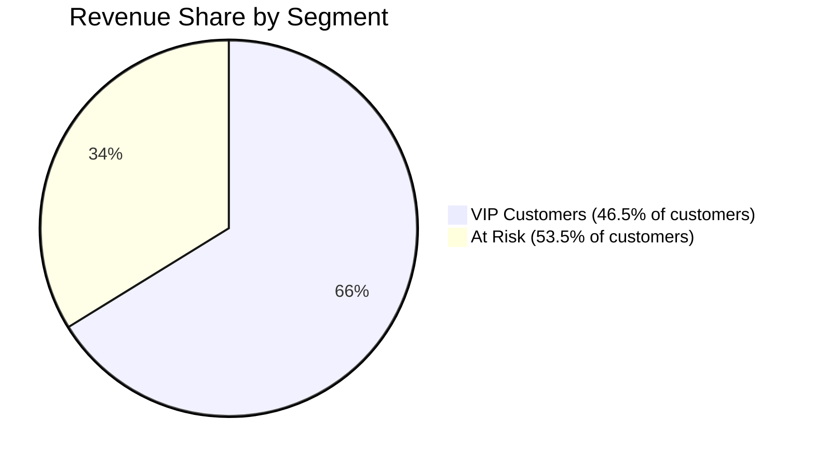

<div align="center">

# 🛍️ Retail & Marketing Analytics

### Customer segmentation and growth strategy for retail transaction data

Find the customers who actually drive revenue — not the ones who buy the most often — and build a retention strategy around them.


</div>

---

Most retail dashboards report *what* happened — revenue by month, top products, order counts. They rarely answer the question that actually changes strategy: **which customers, if you lost them, would hurt the most?**

That's a segmentation problem, not a reporting problem. This project builds the full pipeline to answer it — RFM scoring, statistically validated clustering, cohort-based retention tracking, CLV estimation, and a 15+ metric KPI framework — and turns it into a prioritized action plan.

```text
SEGMENT: VIP Customers
  size:            924 customers   (46.5% of base)
  avg recency:     45.8 days
  avg frequency:   6.9 orders
  avg monetary:    $772.36
  revenue share:   66.2% of total revenue
  action  →        exclusive rewards, early access, dedicated retention effort
```

---

## A note on the data

The Kaggle CSV wasn't available in the analysis environment at run time, so the pipeline falls back to a synthetically generated 10,000-row dataset (`np.random.seed(42)`, realistic retail distributions across orders, customers, categories, discounts, and profit). **Every result in this README is computed from that synthetic dataset**, not the original Kaggle source. The pipeline runs unchanged against the real dataset once it's available — see [Limitations](#limitations--future-work).

---

## Quickstart

Requires **Python 3.9+**.

```bash
git clone https://github.com/SidhantMudgal/Retail-And-Marketing-Analytics-Project-.git
cd Retail-And-Marketing-Analytics-Project-
pip install -r requirements.txt
jupyter notebook notebooks/Capstone2_Retail_and_Marketing_Analytics_Project.ipynb
```

For the interactive Dash dashboard:

```bash
python dashboards/dash_app.py
# then open http://127.0.0.1:8050
```

The full Power BI build is documented in [`docs/PowerBI_dashboard.docx`](docs/PowerBI_dashboard.docx).

---

## How it works

```mermaid
flowchart LR
    A[Data Acquisition] --> B[Cleaning &<br/>Feature Engineering]
    B --> C[Exploratory<br/>Analysis]
    C --> D[RFM Scoring]
    D --> E[K-Means<br/>Clustering]
    E --> F[Cohort &<br/>CLV Analysis]
    F --> G[15+ Metric<br/>KPI Framework]
    G --> H[Power BI<br/>Dashboard]

    style A fill:#1E2761,color:#fff
    style B fill:#1E2761,color:#fff
    style C fill:#1E2761,color:#fff
    style D fill:#C9962F,color:#fff
    style E fill:#C9962F,color:#fff
    style F fill:#34408A,color:#fff
    style G fill:#34408A,color:#fff
    style H fill:#2F7D5C,color:#fff
```



1. **Acquire & inspect** — load transactional data, check shape, types, missing values
2. **Clean & engineer** — handle missing values, remove duplicates, IQR-based outlier treatment, derive time-based and behavioral features
3. **Explore** — univariate/bivariate analysis, time-series trends, product performance
4. **Score & cluster** — standardize RFM features, evaluate K = 2–10 via Silhouette and Davies-Bouldin scores, profile the winning clusters
5. **Track retention** — build monthly acquisition cohorts, measure CLV against an assumed CAC
6. **Report** — export a 15+ metric KPI framework consumed by the Power BI dashboard

Tech stack: Python (pandas, numpy, scikit-learn, matplotlib, seaborn, plotly), Power BI, Jupyter.

---

## Key results

*(Pulled directly from the notebook's executed output — not rounded or adjusted.)*

| Metric | Value |
|---|---|
| Total Revenue | $1,078,670.98 |
| Total Orders | 10,000 |
| Total Customers | 1,986 |
| Average Order Value | $107.87 |
| Profit Margin | 18.38% |
| Repeat Customer Rate | 96.27% |
| Customer Retention Rate | 89.12% |
| Average Customer Lifetime Value | $7,521.29 |

<details>
<summary><b>See the full KPI output</b></summary>

```text
================================================================================
COMPREHENSIVE KPI FRAMEWORK
================================================================================

 REVENUE METRICS
Total Revenue: $1,078,670.98
Total Orders: 10,000
Avg Order Value (AOV): $107.87
Total Units Sold: 50,065
Total Profit: $198,274.85
Profit Margin: 18.38%

 CUSTOMER METRICS
Total Customers: 1,986
Revenue Per Customer: $543.14
Avg Orders Per Customer: 5.04
Repeat Customers: 1,912 (96.27%)
One-Time Customers: 74

 CLV & MARKETING METRICS
Avg Customer Lifetime Value: $7,521.29
Customer Acquisition Cost (CAC): $50.00   [assumed, not measured — see Limitations]
CLV to CAC Ratio: 150.43x
CAC Payback Period: 4.4 months

 RETENTION & CHURN METRICS
Churned Customers (>180 days): 216
Churn Rate: 10.88%
Retention Rate: 89.12%
```

</details>

---

## Customer segmentation

RFM features (Recency, Frequency, Monetary) were standardized and clustered with K-Means across k = 2–10. **k = 2 gave the strongest, most statistically distinct separation** (Silhouette = 0.381, Davies-Bouldin = 0.974) — a clear high-value core versus a lower-engagement majority, rather than the finer gradient a business team might expect.





**Why this over a naive top-spender list?** Clustering separates customers by *behavioral pattern* (how recently, how often, how much) rather than a single ranked metric — so "VIP" means consistently engaged, not just one big historical order.

**Recommended actions**

| Segment | Action | Rationale |
|---|---|---|
| VIP Customers | Exclusive rewards, early access, dedicated retention effort | Under half the customer base drives two-thirds of revenue — losing them is the biggest single risk |
| At Risk | Recency-triggered win-back campaigns, re-engagement offers | Average recency (112.8 days) is already well past the point where re-engagement gets harder |

A finer, business-rule-based 4-tier system (quartile RFM scoring, independent of clustering) is a natural next iteration — see [Limitations](#limitations--future-work).

---

## Cohort retention

Fourteen monthly acquisition cohorts (Jan 2022–Feb 2023) were tracked from first purchase onward.

| Months since first purchase | 0 | 1 | 2 | 3 | 6 | 12 |
|---|---|---|---|---|---|---|
| Retention (avg across cohorts) | 100% | ~30% | ~29% | ~30% | ~30% | ~27% |

The pattern is consistent across cohorts: a sharp drop after month one, then a stable ~27–35% "core" repeat-buyer band rather than continued decay — retention efforts should target the month-0-to-month-1 transition, where the largest single drop-off happens.

---

## Repository structure

```
Retail-And-Marketing-Analytics-Project-/
  data/
    raw/                    # source data
  notebooks/
    Capstone2_Retail_and_Marketing_Analytics_Project.ipynb
  outputs/
    figures/                 # saved chart images
    reports/                 # KPI summary, cohort retention CSVs
  dashboards/
    dash_app.py              # Python Dash interactive dashboard
  docs/
    PowerBI_dashboard.docx
  requirements.txt
```

---

## Limitations & future work

- **Synthetic data** — every figure above reflects a generated dataset, not the real Kaggle source. Treat this as a methodology demonstration until re-run on real data.
- **CAC is assumed, not measured** — the $50 flat Customer Acquisition Cost is a placeholder; a real CAC from actual marketing spend would make the CLV/CAC ratio benchmark-comparable.
- **Market Basket Analysis was scoped but not completed** in this run (the `mlxtend` dependency wasn't installed) — a logical next step for product cross-sell recommendations.
- **Only 2 clusters were statistically optimal** via K-Means; a 4-tier RFM quartile scoring system would give finer-grained segments for targeted campaigns and is planned as a follow-up.

---

## Contact

**Sidhant Mudgal**
[github.com/SidhantMudgal/Retail-And-Marketing-Analytics-Project-](https://github.com/SidhantMudgal/Retail-And-Marketing-Analytics-Project-)
